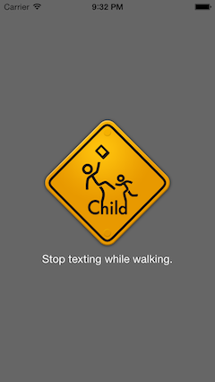

# Stop-Walking-iPhone
Stop-Walking-iPhone is a library that showing warning on app when texting while walking with iPhone.



# Requirements
- iOS 7 or later
- ARC
- Device include M7

# Usage
## Start
``` objc
[SWIManager.sharedManager start];
```

## Stop
``` objc
[SWIManager.sharedManager stop];
```

# Customize
## Localization
Using `Stop texting while walking.` key to localize.
Add value for `Stop texting while walking.` to `Localizable.strings` file on your project.

```
"Stop texting while walking." = "歩きスマホはやめましょう";
```

If want to use another key, set localized string to `text` property.

``` objc
SWIManager.sharedManager.text = NSLocalizableString(@"Stop", nil);
```

## Use original images
Set `image` property.

``` objc
SWIManager.sharedManager.image = ... // set your original image
```

## Use original warning view

``` objc
UIView *customWarning = ...
SWIManager.sharedmanager.warningView = customWarning;
```

## Set duration to show warning

``` objc
// if you want to show 5 seconds after handled walking
SWIManager.sharedmanager.seconds = 5;
```

## Notifications

- `kSWIManagerWarningDidShowNotificaiton`

    `SWIManager` did show warning. Stop your application if needed.

- `kSWIManagerWarningDidHideNotificaiton`.

    `SWIManager` did hide warning. Restart your application if needed.

# Install

## CocoaPods
```
pod 'Stop-Walking-iPhone', :git => 'https://github.com/yashigani/Stop-Walking-iPhone'
```

## Manually
Drag and Drop `Stop-Walking-iPhone` directory to your project.

# Licence
MIT Licene

Copyright (c) 2013 Taiki Fukui

Permission is hereby granted, free of charge, to any person obtaining a copy of this software and associated documentation files (the "Software"), to deal in the Software without restriction, including without limitation the rights to use, copy, modify, merge, publish, distribute, sublicense, and/or sell copies of the Software, and to permit persons to whom the Software is furnished to do so, subject to the following conditions:

The above copyright notice and this permission notice shall be included in all copies or substantial portions of the Software.

THE SOFTWARE IS PROVIDED "AS IS", WITHOUT WARRANTY OF ANY KIND, EXPRESS OR IMPLIED, INCLUDING BUT NOT LIMITED TO THE WARRANTIES OF MERCHANTABILITY, FITNESS FOR A PARTICULAR PURPOSE AND NONINFRINGEMENT. IN NO EVENT SHALL THE AUTHORS OR COPYRIGHT HOLDERS BE LIABLE FOR ANY CLAIM, DAMAGES OR OTHER LIABILITY, WHETHER IN AN ACTION OF CONTRACT, TORT OR OTHERWISE, ARISING FROM, OUT OF OR IN CONNECTION WITH THE SOFTWARE OR THE USE OR OTHER DEALINGS IN THE SOFTWARE.
